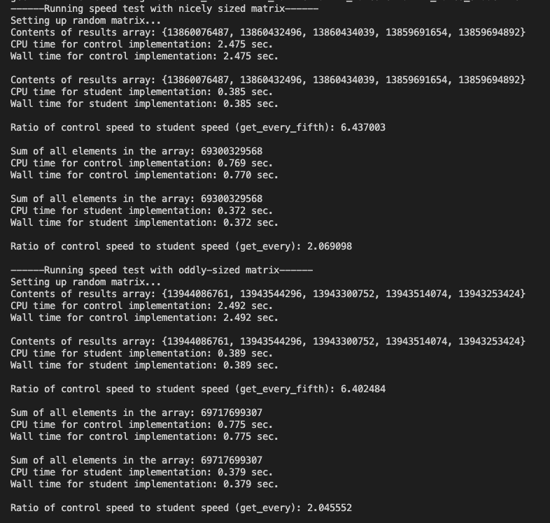

# Matrix_Speedup



# Welcome!
- In this project I wrote code aiming to be faster than the example function that had been written. I had to use ideas of how modern processors work, determining cache misses, and using row-major ordering to save data on the heap.

# What I learned
- Using knowledge of processor design to write code that can run quickly on modern processors
- Timing and testing different algorithms that do the same thing and discussing the results
- Knowing how data is loaded into the cache and being able to determine how many cache misses will occur for a given algorithm
- Understanding and discussing the difference between wall time and CPU time

In this project, I implemented 3 different matrix operations more efficiently than the initial versions provided to me. This involved thinking about both how to write code that uses modern processor features to run quickly and considering the algorithm used to iterate through data to access that data efficiently. I had to achieve up to a 6 times faster speedup ratio than the previous functions given to me. This included large matrices and oddly sized matrices to check that all types of inputs would still work.


This data was saved using the 2D matrix as a 1D array using the same row-major ordering and saving that on the heap.


How the data is stored is important to know to figure out how to write code to access it quickly. Some techniques work on contiguous data that would not work if the rows were scattered on the heap. We want to be clear that this data is saved contiguously.


I had to use things like loop unrolling, nested loops, row-major ordering to complete this speedup.


I also had to do a speedup ratio on summing all the elements in a matrix and returning the result, as well as multiplying 2 matrices and returning the resulting matrix.

## <a href="https://youtu.be/veNB-O33NoU"> Demo Video on YouTube </a>

## Setup

If you want to play around with Matrix_Speedup, feel free to clone my repo. To start, please enter the following commands on your terminal:

```
git clone https://github.com/CamNagle24/Bitwise-Puzzle
make
```

At this point, you are free to type in whatever sequence of commands you like.

Run benchmarking tests on get_every an get_every_fifth:

```
make test
```

Or Run benchmakring tests on matmul:

```
make testmul
```

./btest will give you all the tests that the code tests and passes.
